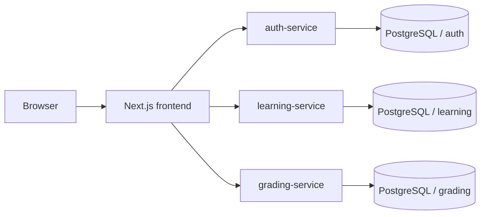

# Lumina (TutorAssist AI)

*This project was created as part of the CM3070 Final Year Project (BSc Computer Science, University of London) by Lyndy Koh.* 

*IMPORTANT NOTE: This application requires an API to run, and i am unable to upload the API key to github, replace with own API key in env when testing*

## Overview

Lumina is a hybrid Tutor-and-Student learning platform designed for Singapore Primary Science. Tutors organise classes, enrol existing Student accounts, create taxonomy-backed questions and worksheets, review uploaded completed work, and approve marking outcomes. Students receive assigned work, upload handwritten physical worksheets, correct low-confidence OCR text, and follow their academic progress.

The application uses a Next.js frontend, three Spring Boot microservices, isolated PostgreSQL schemas, and Docker Compose. Live AI/OCR calls use an operator-provided OpenAI-compatible provider key to orchestrate a three-model pipeline (Qwen, Prompt Guard, and GPT-OSS-20B); no provider key is committed.

## Features and Evidence

| Capability | Implementation | Automated Evidence |
| --- | --- | --- |
| Account registration, login, JWT roles, and Tutor bootstrap | [auth-service](https://www.google.com/search?q=backend/auth-service&utm_source=gemini) | `AuthControllerIntegrationTest.java` |
| Tutor classes, schedules, and existing-Student memberships | [classroom package](https://www.google.com/search?q=backend/learning-service/src/main/java/com/lumina/learning/classroom&utm_source=gemini) | `ClassStudentMembershipIntegrationTest.java` |
| P5/P6 taxonomy-backed question bank and worksheets | [question package](https://www.google.com/search?q=backend/learning-service/src/main/java/com/lumina/learning/question&utm_source=gemini) | `P6ScienceQuestionBankSeedIntegrationTest.java` |
| Student worksheet library and image upload route | [worksheet pages](https://www.google.com/search?q=frontend/src/app/%2528main%2529/worksheets&utm_source=gemini) | `StudentWorksheetLibraryIntegrationTest.java` |
| Submission pages, OCR correction, and Tutor review | [submission controller](https://www.google.com/search?q=backend/grading-service/src/main/java/com/lumina/grading/controller/SubmissionDocumentController.java&utm_source=gemini) | `OcrSubmissionFinalizationIntegrationTest.java` |
| Mastery, subject-profile insight, reports, and alerts | [insight package](https://www.google.com/search?q=backend/learning-service/src/main/java/com/lumina/learning/insight&utm_source=gemini) | `SubjectProfileIntegrationTest.java` |
| Responsive and keyboard-accessible browser UI | [shared UI components](https://www.google.com/search?q=frontend/src/components&utm_source=gemini) | `responsive-accessibility.spec.ts` |
| Offline Compose browser checks | [fixture Compose overlay](https://www.google.com/search?q=compose.e2e.yaml&utm_source=gemini) | `ci.yml` |

## Architecture

The system utilizes a decoupled microservices architecture with a Human-in-the-Loop (HITL) AI pipeline.



Each application service owns its Flyway migrations. Cross-service identity references use stable user IDs rather than shared application tables.

## Database Schema

The database relies on a centralized PostgreSQL instance partitioned into isolated schemas (`auth`, `learning`, `grading`). Migration integration tests remain the database source of truth, ensuring strict data boundaries for sensitive student grading data.

## Prerequisites

Install Docker Desktop/Engine with Compose v2 and Git for the container workflow. Direct local checks also need Node.js 20, npm, and a complete JDK 17 with `javac`.

## Clean-Checkout Quick Start

```bash
git clone 
cd lumina
cp .env.example .env

```

Before continuing, replace every `change-me` value in `.env` with a real local secret. Use the same database password in all database variables, a JWT secret of at least 32 random bytes, and a separate high-entropy `LEARNING_MARKING_SYNC_KEY`.

```bash
make deps
make compose-config
make compose-up
make compose-ps

```

Expected result: `postgres`, `auth-service`, `grading-service`, `learning-service`, and `frontend` become healthy. Open [http://localhost:3000](http://localhost:3000?utm_source=gemini); Adminer is at [http://localhost:8080](http://localhost:8080?utm_source=gemini). Use `make compose-logs` to investigate, `make compose-down` to preserve volumes, and `make compose-reset` only for disposable data.

## Configuration

`.env.example` is the complete development variable template. It must never be committed as `.env`.

| Variable | Purpose |
| --- | --- |
| `POSTGRES_*` | Local PostgreSQL account and database. |
| `JWT_SECRET` | Server-side signing key shared by services. |
| `LEARNING_MARKING_SYNC_KEY` | Private grading-to-learning hand-off key. |
| `AI_ENGINE_URL`, `AI_ENGINE_MODEL`, `AI_VISION_MODEL`, `AI_ENGINE_API_KEY` | OpenAI-compatible marking and OCR provider settings (e.g., Groq API). |
| `NEXT_PUBLIC_*_API_URL` | Browser-visible development API origins. |
| `FRONTEND_ALLOWED_ORIGINS` | Browser origins permitted by backend CORS. |

Normal Compose is a development topology and publishes diagnostic service ports. The production-shaped overlay exposes only Nginx and reads secrets from `../secrets.txt`.

## Test Accounts

Ordinary local development has no committed credentials. Create a Student at `/signup`. To create the first Tutor, set all three `BOOTSTRAP_TUTOR_*` values for one clean startup; existing Tutor credentials are never reset.

The disposable offline E2E environment seeds only these temporary accounts:

| Role | Email | Password |
| --- | --- | --- |
| Tutor | `e2e.tutor@example.test` | `E2eTutor!Pass123` |
| Student | `e2e.student@example.test` | `E2eStudent!Pass123` |

## Development Commands

| Command | Outcome |
| --- | --- |
| `make deps` | Installs locked root and frontend JavaScript dependencies. |
| `make compose-config` | Validates `.env` and development Compose configuration. |
| `make compose-up` / `make compose-down` | Starts / stops the development stack. |
| `make compose-ps` / `make compose-logs` | Shows health status / follows logs. |
| `make frontend-lint`, `make frontend-typecheck`, `make frontend-test` | Runs frontend checks. |
| `make backend-test` | Runs Maven verification for all services. |
| `make ci` | Runs the local pull-request-equivalent suite. |

Run `make help` for every target.

## Testing and Validation

```bash
make frontend-lint
make frontend-typecheck
make test
make ci

```

`make ci` needs Docker and registry access for its Compose stage. Use `git diff --check` before committing.

## Offline Compose Browser Tests

The browser suite uses deterministic local AI/OCR mock and seed services; it does not use a live provider key during automated testing to prevent rate-limiting and ensure cost-free CI.

```bash
make e2e-chrome
make e2e-config
make e2e

```

On Linux use `make e2e-chrome-linux`. `make e2e` creates a clean fixture stack, waits for healthy services, runs Playwright, and removes its E2E containers and volume even after failure. Use `make e2e-up`, `make e2e-test`, and `make e2e-down` to inspect stages.

## Deployment

The VM-only production-shaped deployment uses `lumina.sg` as a temporary hosts-file name and a self-signed certificate. It is not a public Internet deployment. Only the Nginx edge is published on ports 80 and 443.

```bash
cp .env.production.example .env.production
make production-secrets
chmod 600 ../secrets.txt
make vm-tls
make production-config
make production-up
make production-ps

```

Set the provider key only in `../secrets.txt`.

## Security and Privacy

* APIs enforce roles, resource ownership, validation, CORS, and response headers.
* Keep `.env`, `../secrets.txt`, provider keys, JWT secrets, and TLS private keys outside version control.
* User-facing disclosures: Privacy Policy and Terms of Service are reviewed against the deployed provider (Groq) and retention policy before public release.

## Continuous Integration

`.github/workflows/ci.yml` has two tiers:

* Pull requests run `Frontend checks`, three `Backend checks` matrix entries, and `Compose configuration and images`.
* `main`, nightly, and manual runs execute `Offline E2E`, retaining failure artefacts and Compose logs for 14 days.

## Known Limitations

* VM-only TLS uses a self-signed certificate and temporary hosts-file entry.
* Provider-dependent OCR/marking needs a real key and deployment smoke test; offline E2E uses deterministic fixtures instead.
* Development Compose publishes diagnostic ports; use the production overlay for private service networking.

## Author

**Lyndy Koh**

*CM3070 Final Year Project*
